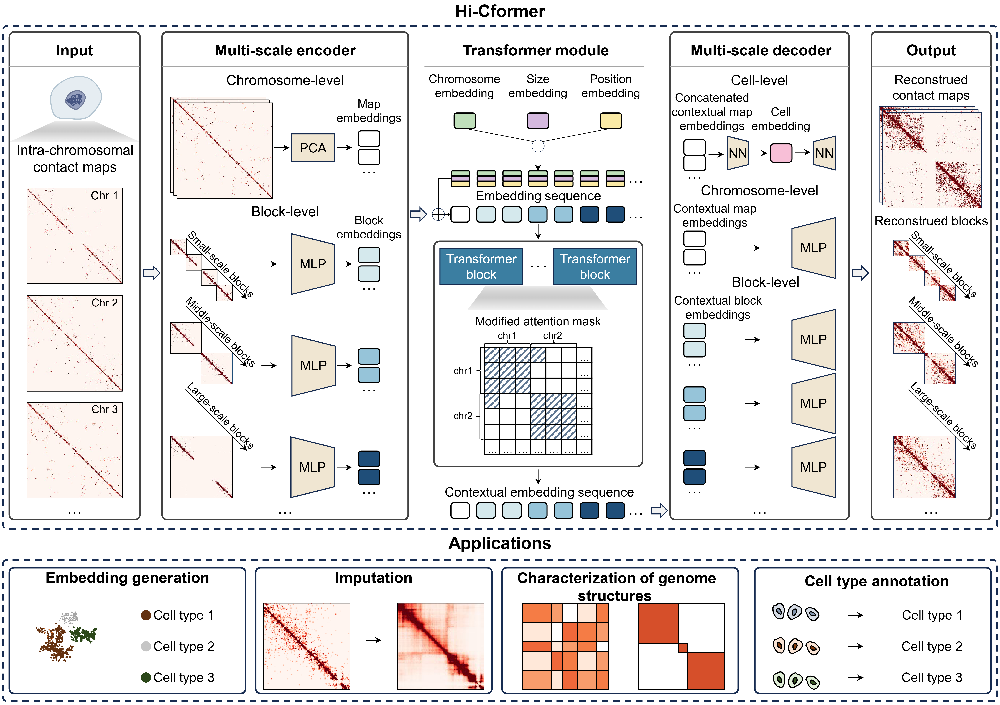

# Hi-Cformer

**Hi-Cformer** is a transformer-based model designed to analyze single-cell Hi-C (scHi-C) data, addressing the inherent challenges of sparsity and uneven contact distribution. Hi-Cformer targets the **complex, multi-scale, and local patterns** in scHi-C contact maps by modeling chromatin interactions across diverse genomic distances.

Built upon a multi-scale attention framework, Hi-Cformer simultaneously captures both broad and fine-grained chromatin interaction features. It delivers **low-dimensional representations** of single cells that are highly informative for tasks such as clustering, cell type annotation, and imputation of 3D genomic signals. Its robust design supports generalization across different datasets and resolutions, offering a versatile tool for 3D genome analysis at single-cell resolution.

<p align="center">
  
</p>

---

## 🚀 Highlights

- **Multi-scale modeling of scHi-C maps**: Captures interaction blocks across genomic distances with specialized attention modules.
- **Representation learning**: Derives low-dimensional embeddings that reflect chromatin structure heterogeneity.
- **Accurate imputation of 3D genomic features**: Recovers interaction signals such as TAD-like boundaries and A/B compartments from sparse data.
- **Generalizable cell type annotation**: Embeddings can be used for robust classification across datasets.

---

## Tutorial

This repository includes a tutorial example to help users get started with Hi-Cformer.

- **Demo notebook:**  
  The file [`demo/Ramani_tutorial.ipynb`](demo/Ramani_tutorial.ipynb) contains a step-by-step example using data from the Ramani2017 dataset.  
  It explains the input file format, runs Hi-Cformer, and demonstrates how to generate and visualize embeddings and imputation results.

- **Example configuration:**  
  The file [`demo/config_ramani.json`](demo/config_ramani.json) provides an example configuration for running the Ramani2017 tutorial.

- **Example input data:**  
  Example input files are provided in the [`data/`](data/) directory.

- **Quick start with training and inference script:**  
  You can also use the Python script [`hicformer/train_inference.py`](hicformer/train_inference.py) to train Hi-Cformer and perform inference.  
  Before running the script, please check and modify the input paths and configuration file according to your local environment.

Example usage:

```bash
python hicformer/train_inference.py --config demo/config_ramani.json
```

---

## 📖 Citation

If you use **Hi-Cformer** in your research, please cite:

> Xiaoqing Wu, Xiaoyang Chen, Zian Wang, Rui Jiang. *Hi-Cformer enables multi-scale chromatin contact map modeling for single-cell Hi-C data analysis*.

---

## 📬 Contact

For questions or collaborations, please contact:

**Email**: xq-wu24@mails.tsinghua.edu.cn  
**GitHub**: [@Xiaoqing-Wu02](https://github.com/Xiaoqing-Wu02)
