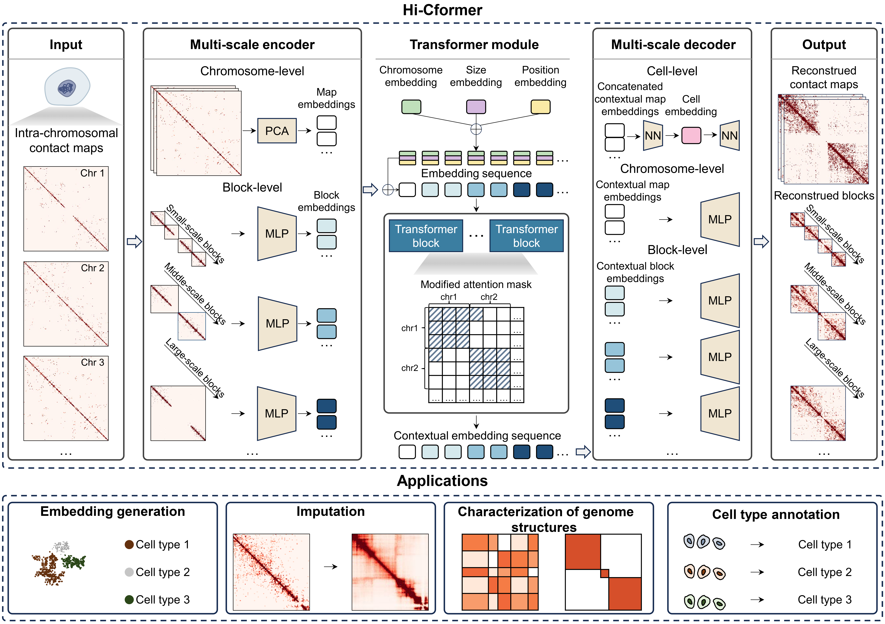

# Hi-Cformer

Hi-Cformer is a transformer-based model for analyzing single-cell Hi-C data. It learns low-dimensional cell representations from sparse chromatin contact maps and supports clustering, cell type annotation, and contact-map imputation.

<p align="center">
  
</p>

## Installation

Python 3.9 or newer is required. Install PyTorch for the CUDA version on your machine, then install this project:

```bash
pip install -e .
```

## Configurations

Configuration files for Ramani2017, Lee2019, Tan2021A, Tan2021B, and Wu2024 are provided in `configs/`.

## Data layout

All paths in the provided configurations are relative to the project root. Ramani2017 example data are included. For the remaining datasets, place the inputs in the layout below or edit `label_path` and `raw_path` in the corresponding configuration:

```text
data/
├── Ramani2017/
│   ├── label_info.pickle
│   └── raw/chr*_sparse_adj.npy
├── Lee2019/
│   ├── label_info.pickle
│   └── raw/chr*_sparse_adj.npy
├── Tan2021A/
│   ├── label_info.pickle
│   └── raw/chr*_sparse_adj.npy
├── Tan2021B/
│   ├── label_info.pickle
│   └── raw/chr*_sparse_adj.npy
└── Wu2024/
    ├── label_info.pickle
    └── raw/chr*_sparse_adj.npy
```

Each chromosome file must contain one sparse contact matrix per cell. Cell order must be identical across chromosomes and must match `label_info.pickle`.

## Training and inference

Run a dataset by supplying its name and the physical GPU index:

```bash
./run.sh Ramani2017 0
./run.sh Lee2019 0
./run.sh Tan2021A 0
./run.sh Tan2021B 0
./run.sh Wu2024 0
```

A configuration can also be launched directly:

```bash
CUDA_VISIBLE_DEVICES=0 python -m hicformer.train_inference \
  --config configs/Ramani2017.json --cuda 0
```

Training outputs are written beneath `experiments/<dataset>/`. They include the requested and resolved configurations, timestamps, training log, checkpoint, training history, PCA cache, and final cell embeddings.

## Demo

The Ramani2017 tutorial uses the same configuration as the main training entry point:

- `demo/Ramani2017_tutorial.ipynb`
- `configs/Ramani2017.json`
- `data/Ramani2017/`

Launch Jupyter from the repository root or from `demo/` and run the notebook cells in order. Generated files are written to `demo/tutorial_output/`, which is ignored by Git.

## Citation

Wu, X., Wang, Z., Jiang, R., & Chen, X. (2026). Hi-Cformer enables multiscale chromatin contact map modeling for single-cell Hi-C data analysis. *Science Advances*, *12*(35), eaeg0134.

## Contact

Xiaoqing Wu: xq-wu24@mails.tsinghua.edu.cn
